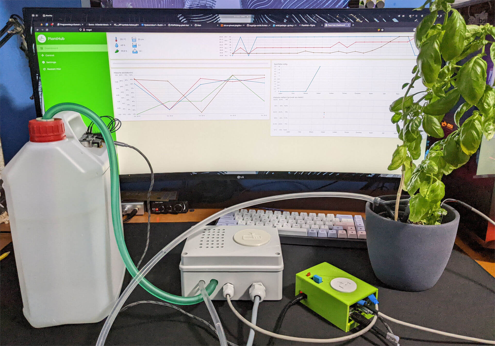

# 🌱 plant-hub

Ultra advanced smart irrigation system.

<div style="text-align: center;">
  
</div>

## 🍔 Tech stack

### 🖥️ Server and main app

- Chad GoLang
- Postgres DB :5420
- communication with HW modules/sensors via GPIO
- GraphQL API for DB data
- REST API for live data from sensors

### 🌿 Web app (client)

- React
- Tailwind
- Material UI
- [Design on Figma](https://www.figma.com/file/7gMKRPDOrkKOT5GKmOmfsu/PlantHub?node-id=0%3A1)

##🔧 Setup on RPi

clone the repository

```bash
git clone git@github.com:POJFM/dmp-plant-hub.git
cd dmp-plant-hub
```

create server and docker `.env` files

```bash
# server .env
cp server/.env.example server/.env
# docker .env
cp docker.env.example docker.env
```

let docker do its thing

```bash
docker-compose up -d
```


## 📦 Build docker images for arm

create client `.env` file

```bash
cp client/.env.example client/.env
```

setup docker

```bash
# create bob the builder
docker buildx create --name bob
# switch to bob
docker buildx use bob
docker buildx inspect --bootstrap
docker login
docker buildx
```

build and push images or run `scripts/build-docker.sh`

```bash
# client image
docker buildx build --platform linux/amd64,linux/arm64,linux/arm/v7 -t tassilobalbo/planthub-client --push client/.
# server image
docker buildx build --platform linux/arm64,linux/arm/v7 -t tassilobalbo/planthub-server --push server/.
```

## 🏠 Setup local subnet

- Install dhcp package:
  `yay -Syu dhcpcd`
- Configure subnet in `/etc/dhcpd.conf`:

```
subnet 192.168.0.0 netmask 255.255.255.224 {
  range 192.168.0.10 192.168.0.20;
}
```

- Add your network card to subnet
  `sudo ip addr add 192.168.0.1/24 dev enp3s0`
- Restart dhcp daemon
  `systemctl restart dhcpd4`
