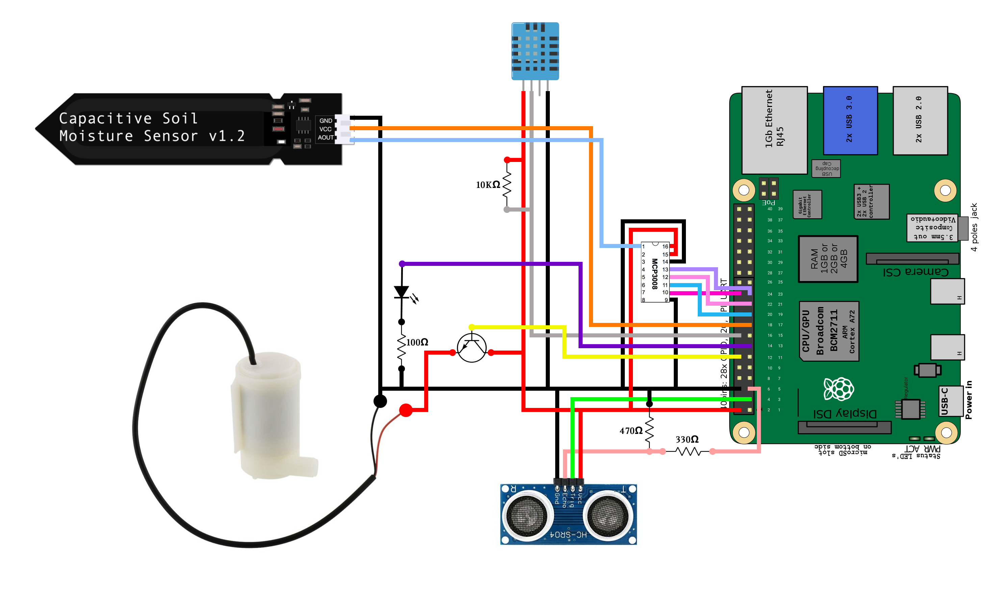

# Maturitní práce

## Školní rok: 2021/22

## Autoři: Filip Sikora, Jakub Vantuch

## Název: Automatický zavlažovací systém PlantHub

## Zadání v bodech:

### Vantuch

- hardwarové řešení - stanovení cílů, volba hardware (řídící jednotka, senzory, akční členy)

- návrh obvodu a plošného spoje

- fyzická realizace

- naprogramování řídící jednotky

- interaktivní ovládání PlanHubu z webového UI

- Ověření funkčnosti

### Sikora

- softwarové řešení - stanovení cílů, volba sw platformy a konkrétního software

- konfigurace RPi jako webového serveru

- vytvoření databáze

- vytvoření front end

- vytvoření back end

- nastavení bezpečnosti

- interaktivní ovládání PlanHubu z webového UI

- Ověření funkčnosti

## Vymezení pojmů

### API

#### REST

#### GraphQl

### PCB

### RPi

### GPIO

## 1. část maturitní práce - Jakub Vantuch

#### Mé cíly

- Mým cílem je vytvořit funkční zavlažovací systém ovládaný mikropočítačem RaspberryPi, s automatickým spouštěním na základě vlhkosti půdy.
- Systém PlantHub dále získává informace o teplotě, vlhkosti a tlaku vzduchu a promítá je ve svém webovém rozhraní.
- Jelikož voda časem z nádrže dojde systém PlantHub snímá stav hladiny vody v nádrži a včas upozorní, že je třeba doplnit vodu.

### 1.Hardwarové řešení

#### Mikropočítač RaspberryPi 3

- RaspberryPi je jednodeskový mikropočítač s operačním systémem o velikosti platební karty. Neobsahuje displej ani úložiště pouze konektory USB, Ethernet, HDMI a konektor pro univerzální použití (GPIO). V projektu PlantHub představuje RaspberryPi hlavní řídící jednotku obvodu a zároveň webový server pro webové rozhraní.

#### Senzory

#### Senzor teploty a vlhkosti vzduchu DHT11 (Digital hum temp)

- Senzor DHT11 se skládá z jednotky pro měření teploty, jednotky pro měření vlhkosti a převodníku.
- Teplotu měří senzor thermistorem. Thermistor je keramický polovodič, který zmenšuje svou rezistivitu když se okolní teplota zvýší.
- Vlhkost měří senzor na základě rezistivity substrátu umístěného mezi dvěma elektrodami. Tento substrát zachytává vlhkost a vytváří tak vodivé prostředí.

#### Kapacitní čidlo pro měření vlhkosti půdy

- kapacitní čidlo se skládá ze dvou vodivých desek a převodníku. Čidlo funguje na způsob kapacitoru avšak jeho kapacita je ovlivněna vlhkostí, která ovlivňuje dielektrikum mezi dvouma deskama.

#### Ultrasonický senzor

- Ultrasonický senzor vydává zvukové vlny na vysoké frekvenci, neslyšitelné pro lidské ucho. Poté čeká, až se zvuk odrazí zpět, a vypočítá vzdálenost na základě času měřeného od vysílání zvukové vlny k zpětnému příjmutí.

- Všechny naměřené údaje jsou v převodníku daného senzoru přepočítány na jednotky dané veličiny a odeslány analogovým signálem do řídící jednotky.

#### Ponorné mini čerpadlo eses

- Toto čerpadlo se skládá z DC motoru na němž je upevněna centrifuga pro čerpání vody a vlastního pouzdra, z kterého vede otvor pro napojení odtokové hadičky.

### 2. Návrh obvodu a plošného spoje

#### Zapojení

#### Senzor teploty a vlhkosti vzduchu DHT11

- je zapojen do zdroje 5V a země a jeho signální pin je připojen k pinu GPIO23.

#### Kapacitní analogové čidlo pro měření vlhkosti půdy

- je zapojeno do zdroje 3.3V a země a protože RaspberryPi pracuje pouze digitálně, je jeho signální pin připojen k analogově digitálnímu převodníku MCP3008.

#### Ultrasonický senzor

- je zapojen do zdroje 5V a země a jeho piny jsou pomocí I2C sběrnice připojen k pinům GPIO2 a GPIO3.

#### Ponorné mini čerpadlo eses

- je zapojeno přes tranzistor do zdroje 5V a země. Jeho spuštění a vypnutí je ovládáno otevřením a zavřením tranzistoru, jehož báze je připojena k pinu GPIO18.

#### LED dioda

- je zapojena přes 1K ohmový rezistor do země a na pin GPIO27. LED dioda slouží jako přídávná signalizace nízké hladiny vody v nádrži.

#### PCB (Printed circuit board)

- Naše řešení vyžadovalo co nejrobustnější a prostorově úsporné provedení proto jsme se rozhodli pro návrh vlastního tištěného spoje.

### 3. fyzická realizace

### 4. naprogramování řídící jednotky

#### Postup práce

- Řídící jednotku jsme v první verzi programovali ve vysokoúrovňovém jazyce python, od tohoto technického postupu jsme ale rychle upustili vzhledem k pomalému postupu programu a vysokým technickým nárokům. Nakonec jsme se rozhodli pro nízkoúrovňový jazyk Go. Tento programovací jazyk jsme si vybrali především pro jeho rychlost, možnost multi threadingu (Rozdělení programu do samostatně existujících rutin mimo hlavní program), a celkový fakt, že je to jeden z nejmodernějších a slibných technických postupů.
- Program zodpovídá jak za řízení hlavní fyzické jednotky tak i komunikaci s webovou aplikací a následné odesílání naměřených dat na její API (application programming interface).
- Podle pravidel OOP a obecné logiky jsme aktivní části programu rozdělili na 4 fáze.

#### 1. Fáze inicializace

- Půda musí být ze začátku suchá. Kapacitní čidlo pro měření vlhkosti půdy zastrčíme co nejhlouběji do půdy. RaspberryPi bude chvíli sbírat data a pak je zprůměruje do hodnoty, která bude sloužit jako limit pro spuštění čerpadla.
- Ve webovém rozhraní jde navíc ještě manuálně nastavit hranice teploty a vlhkosti vzduchu pro spuštění čerpadla.
- Nastavit se dá také množství vody, které bude přečerpáno při jednom spuštění a jaká je hranice pro přijatelnou výšku hladiny vody v nádrži. Pokud nejsou tyto hodnoty uvedeny čerpadlo bude vodu přečerpávat dokud se nezmění hodnota kapacitního čidla pro měření vlhkosti půdy a ultrasonický senzor použije výchozí nastavení.

#### 2. Fáze měření

- Kapacitní čidlo pro měření vlhkosti půdy a senzor teploty a vlhkosti vzduchu průběžně posílají naměřená data do RaspberryPi, kde se ukládají do databáze. Jestliže naměřené hodnoty překročí limitní hodnoty RaspberryPi pošle signál pro otevření tranzistoru což spustí čerpadlo.

#### 3. Fáze zavlažování

- Čerpadlo začne čerpat vodu a zavlažovat rostlinu. Voda se čerpá tak dlouho dokud kapacitní čidlo pro měření vlhkosti půdy nezmění svou hodnotu nebo dokud není vyčerpán limit přečerpané vody na jedno spuštění.

#### 4. Fáze kontroly

- Po ukončení přečerpávání se spustí ultrasonický senzor a změří výšku hladiny vody. Naměřená data poté odešlě do RaspberryPi kde se uloží do databáze. Pokud bude naměřená hodnota nižší než je limitní hodnota začne blikat LED dioda a RaspberryPi odešle upozornění o doplnění nádrže do webového rozhraní. Jakmile bude hladina doplněna signalizace se vypne.

#### Ukládání dat

#### Základní naměřená data

- Do databáze ukládáme naměřená data, která jsou následně dostupná k přečtení v grafickém rozhraní webové aplikace. Tyto data

#### Data naměřená před zavlažováním

### 5. interaktivní ovládání PlanHubu z webového UI

### 6. Ověření funkčnosti

## 2. část maturitní práce - Filip Sikora

#### Mé cíly

-
-
-

### 1. softwarové řešení - stanovení cílů, volba sw platformy a konkrétního software

### 2. konfigurace RPi jako webového serveru

### 3. vytvoření databáze

### 4. vytvoření front end

- Webovou aplikaci jsme vytvořili ve frameworku React.js založeném na javascriptu. Webová aplikace komunikuje s databází pomocí GraphQl API a ve stejném čase je schopna přijímat live data naměřená pomocí fyzických senzorů za použití REST API, která se odesílají z Go backendu

### 5. vytvoření back end

### 6. nastavení bezpečnosti

### 7. interaktivní ovládání PlanHubu z webového UI

### 8. Ověření funkčnosti
