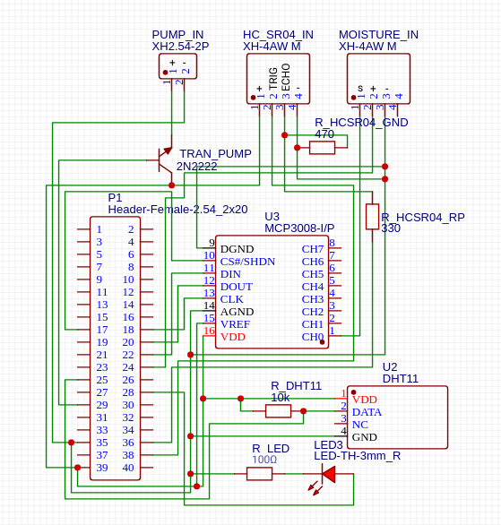
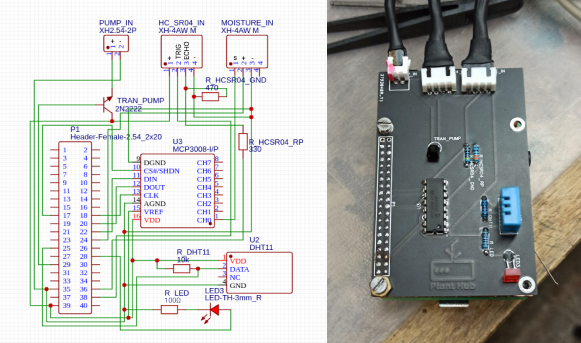
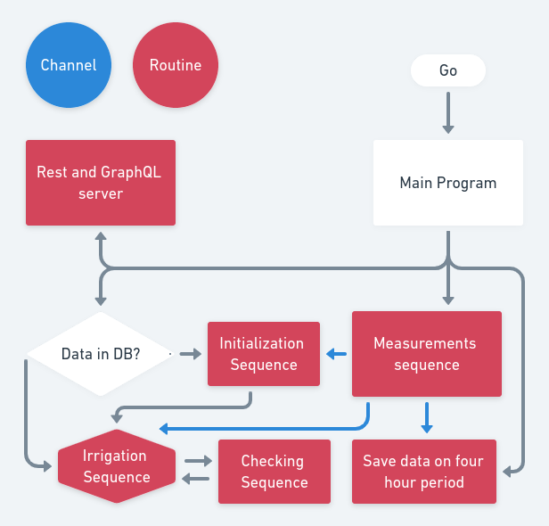
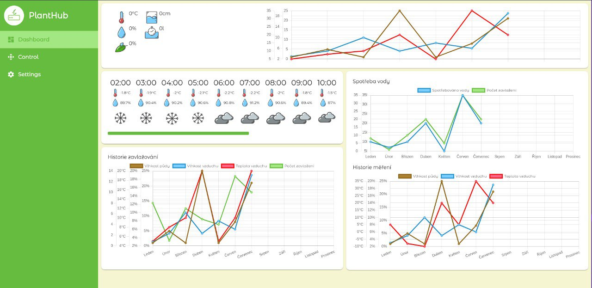
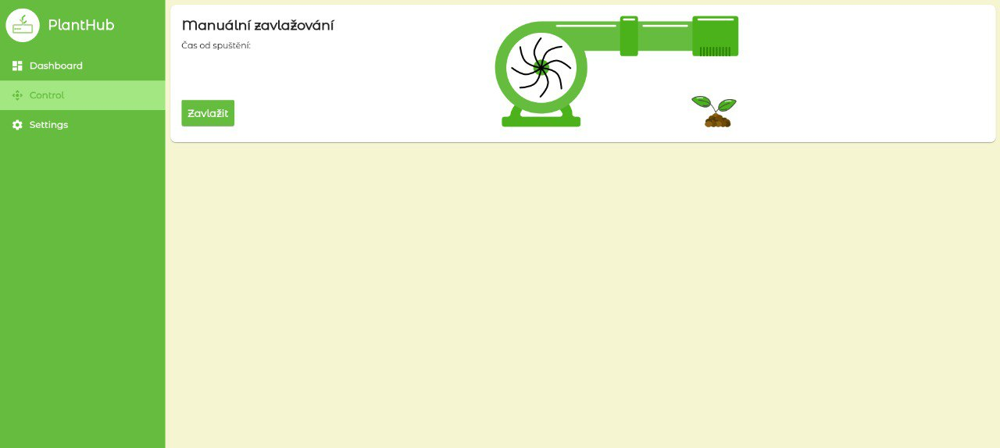
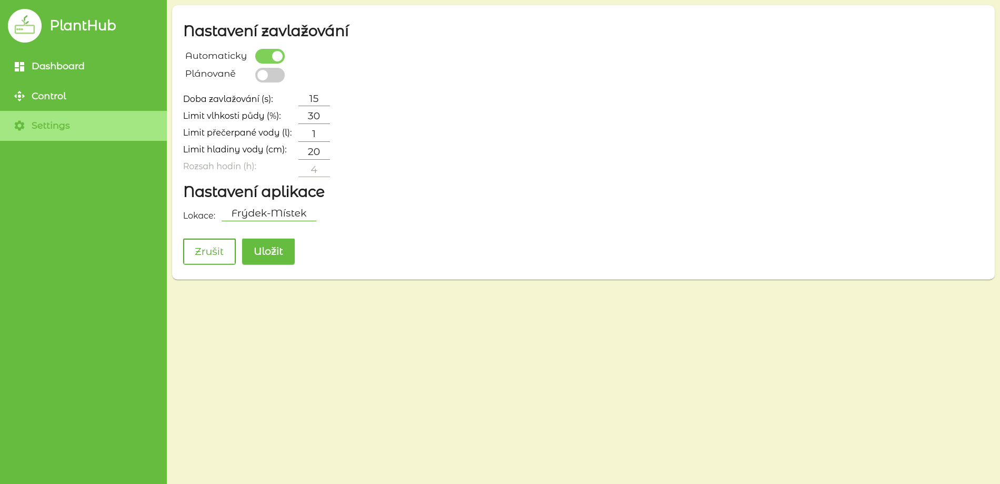

# PlantHub

## Autoři: Filip Sikora, Jakub Vantuch

## Seznam použitých zkratek a symbolů

#### API – Application programming interface

#### REST - Representational state transfer

#### GraphQL – Graph query language

#### PCB – Printed circuit board

#### RPi – Raspberry Pi

#### ARM – Advanced RISC Machines

#### GPIO – General-purpose input/output

#### DHT11 – Senzor teploty a vlhkosti vzduchu – Digital hum temp v.11

#### Senzor vlhkosti půdy – Kapacitní analogové čidlo pro měření vlhkosti půdy

#### HC-SR04 – Ultrasonický senzor vzdálenosti

#### MCP3008 – Analog-digital converter

#### Čerpadlo – Ponorné mini čerpadlo eses

#### 2N2222 - NPN tranzistor

#### SPI – Serial peripheral interface

#### UI – Web user interface

 

PlantHub je automatický zavlažovací systém s webovým uživatelským rozhraním. Jádrem našeho systému je mikropočítač RPi s procesorovou architekturu ARM. Vybrali jsme si ho kvůli kombinace malé velikosti a procesorového výkonu, musí totiž zvládnout řídit všechny senzory, ukládat data do databáze a zároveň na něm běží i samotná webová aplikace. Systém PlantHub dále získává informace o teplotě, vlhkosti a tlaku vzduchu a promítá je ve svém webovém rozhraní. Ve stejné chvíli naměřená data ukládá do databáze v periodě 4 hodin. Jelikož voda časem z nádrže dojde systém PlantHub snímá stav hladiny vody v nádrži a včas upozorní, že je třeba doplnit vodu.

## Hardware

Potřebujeme vyvinout vhodné pouzdro pro naše Raspberry, abychom ochránili citlivé elektronické součástky. Budeme ho tisknout na 3D tiskárně. K zavlažování je potřeba vyvinout i nádrž na vodu ze kterého bude čerpat naše čerpadlo.

### DHT11

Senzor DHT11 se skládá z jednotky pro měření teploty, jednotky proměření vlhkosti a převodníku.

Teplotu měří senzor thermistorem. Thermistor je keramický polovodič, který zmenšuje svou rezistivitu, když se okolní teplota zvýší.

Vlhkost měří senzor na základě rezistivity substrátu umístěného mezi dvěma elektrodami. Tento substrát zachytává vlhkost a vytváří tak vodivé prostředí

### Senzor vlhkosti půdy

Kapacitní čidlo se skládá ze dvou vodivých desek a převodníku. Čidlo funguje na způsob kapacitoru avšak jeho kapacita je ovlivněna vlhkostí, která ovlivňuje dielektrikum mezi dvěma deskami.

### MCP3008

RPi na GPIO pouze digitální vstupy, protože je ale senzor vlhkosti půdy analogový museli jsme použít ADC převodník.

### HC-SR04

HC-SR04 vydává zvukové vibrace na vysoké frekvenci, neslyšitelné pro lidské ucho. Poté čeká, až se zvuk odrazí zpět, a vypočítá vzdálenost na základě času měřeného od vysílání zvukové vlny k zpětnému přijmutí

Všechny naměřené údaje jsou v převodníku senzoru přepočítány na jednotky dané veličiny a odeslány analogovým signálem do řídící jednotky.

### Čerpadlo

Naše zvolené čerpadlo se skládá z DC motoru, na němž je upevněna centrifuga pro čerpání vody a vlastního pouzdra, z kterého vede otvor pro napojení odtokové hadičky

### 2N2222

Protože samotný signální pin neposkytuje dostatečné napětí pro chod čerpadla ovládáme jej NPN tranzistorem

## Obvod

V testovací verzi našeho obvodu jsme postavili na breadboardu, který jsme používali dokud jsme neměli plně otestovanou funkcionalitu hardwaru. V druhé fázi jsme náš obvod předělali do schématu PCB a nechali jej vytisknout.

  
  

## Main program

### Postup práce

Náš hlavní program pro zavlažování a komunikaci s databází a webovým rozhraním jsme začali psát ve vysokoúrovňovém programovacím jazyce python. Od toho jsme ale nakonec upustili kvůli vysokým technickým nárokům, což nám zpomalovalo průběh programu, proto jsme přešli na programovací jazyk GO.

  

### Fáze programu

#### Inicializace

Půda musí být ze začátku suchá. Senzor vlhkosti půdy zastrčíme co nejhlouběji do půdy. Rpi bude chvíli sbírat data a pak je zprůměruje do hodnoty, která bude sloužit jako limit pro spuštění čerpadla.

V UI jde navíc ještě manuálně nastavit hranice teploty a vlhkosti vzduchu pro spuštění čerpadla.

Nastavit se dá také množství vody, které bude přečerpáno při jednom spuštění a jaká je hranice pro přijatelnou výšku hladiny vody v nádrži. Pokud nejsou tyto hodnoty uvedeny čerpadlo bude vodu přečerpávat, dokud se nezmění hodnota kapacitního čidla pro měření vlhkosti půdy a HC-SR04 použije výchozí nastavení.

#### Měření

Senzor vlhkosti půdy a DHT11 průběžně posílají naměřená data do Rpi, kde se ukládají do databáze. Jestliže naměřené hodnoty překročí limitní hodnoty Rpi pošle signál pro otevření tranzistoru což spustí čerpadlo

#### Zavlažování

Čerpadlo začne čerpat vodu a zavlažovat rostlinu. Voda se čerpá tak dlouho dokud senzor vlhkosti půdy nezmění svou hod-notu nebo dokud není vyčerpán limit přečerpané vody na jedno spuštění.

#### Kontrola

Po ukončení přečerpávání se spustí HC-SR04 a změří výšku hladiny vody. Naměřená data poté odešle do Rpi kde se uloží do databáze. Pokud bude naměřená hodnota nižší, než je limitní hodnota začne blikat LED dioda a Rpi odešle upozornění o doplnění nádrže do UI. Jakmile bude hladina doplněna signalizace se vypne.

#### Periodické ukládání dat

V samostatné rutině běží funkce pro ukládání naměřených dat v periodě 4 hodin. Naměřená data jsou následně statisticky zobrazena v UI

### Ukládání dat

Náš systém ukládá zvlášť periodicky naměřená data a data naměřená před zavlažováním, dále ukládá nastavení jak pro limity k zavlažování tak pro webové rozhraní.

## Webové rozhraní

Webovovou aplikaci jsme napsali v javascriptovém frameworku React.js a css frameworku Tailwind. Ve webovém rozhraní je možné zobrazit si statisky jak živě naměřených dat, tak dat uložených v databázi. Z OpenWeather API fetchujeme data o předpovědi počasí.

  

Interaktivné ovládání celého systému lze provést v již zmiňované webové aplikaci. Dovoluje uživateli kdykoliv spustit čerpadlo na zalévání rostliny.

  

V nastavení se dá změnit nastavení aplikace i limitů pro zavlažování. Data se po uložení uloží do databáze.

  

## Databáze

Pro databázi jsme se rozhodli použít databázový systém PostgreSQL. Jak vyplývá z názvu, jedná se o SQL databázi, ty jsou vhodné pro ukládání velkého objemu dat, jako právě data z našich senzorů. Webová aplikace používá pro přístup k datům z databáze GraphQL API.

GraphQL je query, který je konkurent řešení REST API. Nabízí efektivnější tvorbu API a také umožňuje efektivnější přístup k datům z databáze. Umožňuje vybrat pouze data, která momentálně aplikace používá a dovoluje vynechat data, která zrovna potřebné nejsou.

## Web server

Web server jsme napsali v moderním jazyku Go, který nyní roste v popularitě hlavně mezi cloudovými vývojáři a v oblasti vývoje microservices. Dokáže se exekuční rychlostí přiblížit k nízkoúrovňovým jazykům jako je C nebo Rust, ale zároveň zůstává velmi lidsky čitelný a jednoduchý na použití. Na rozdíl od jazyků jako C a Rust má například garbage collector.

## Co nám chybí k dosažení cíle

- RPi case z 3D tisku
- Celková funkcionalita hlavního programu a jeho sekvencí
- Realizace nádrže pro vodu

## Cíle naší práce

Vytvořit chytré automatizované řešení pro zavlažování pokojových, nebo skleníkových rostlin.
