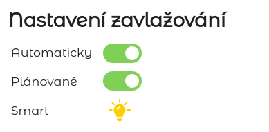
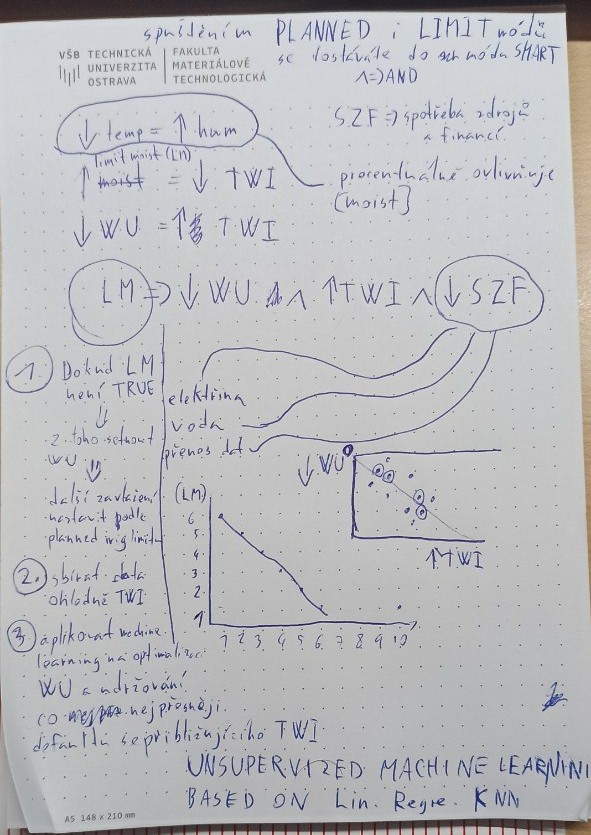
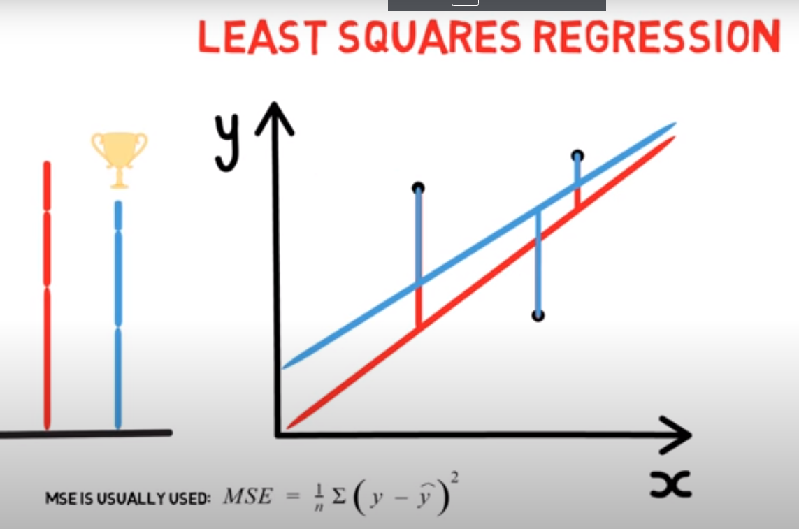

# Adding machine learning to our project

- Closer project details and test data can be found [here](https://docs.google.com/spreadsheets/d/1-FJpnx-kEh30rq1yvBE51RGYzdYJzyGPCxmLcHMqX_w/edit?usp=sharing)
- Explained Go machine learning strategies and practical examples can be found [here](https://github.com/TurniXXD/go-learn)

## Init

- Machine learning is on only when you are using both the scheduled irrigation mode and limit irrigation mode by that you are entering the smart mode where our machine determines the best irrigation options by learning and forecasting the outcomes by utilizing weather forecast previously learned data about the amount of water needed and time to next irrigation thus saving you water and money

 

 

## Variables

- Default scheduled irrigation based on type of flower, we need access to flowers database and their projected period of irrigation
- Placement of flowerbed INSIDE / OUTSIDE / GREENHOUSE
- Moisture limit, which is calculated on machine initialization

## Process

1. On first irrigation wait until the moisture limit is reached. Get the amount of water that was spend on first irrigation and set the amount of water for one irrigation based on that.
2. Gather irrigation data like weather forecast, it's probability and time without irrigation and wait for total of 10 irrigations.
3. After tenth irrigation machine learning is utilized and starts modifying the water amount used for single irrigation based on the time that our machine lasted before another irrigation and weather forecast thus calculating how much water will be needed and taking into account the default scheduled irrigation period

 

 

## Algorithm

- We will be using unsupervized machine learning based on linear regression.
- We will use the [go-learn package](https://github.com/sjwhitworth/golearn) for easier algorithms and [gonum package](https://www.gonum.org/) for easier manipulation with vector and matrix types

 

 
